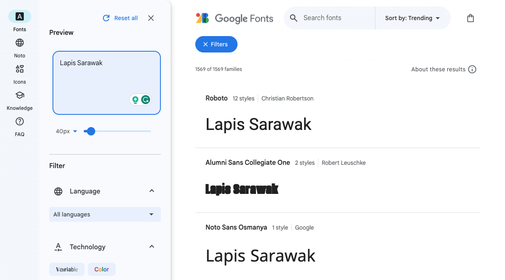

Google has a free online font library with over 1400 fonts to choose from. The site allows you to browse different fonts using your own sample text to help you find the right font. Google Fonts then gives you the **HTML** and **CSS** code that you need to **import** the font into your website. 

Open [fonts.google.com](https://fonts.google.com/){:target="_blank"}. It will open in a new tab. 

Type in some sample text in the **sentence** box.

**Notice** how the examples below now show your sample text. You can see how your words look in all of the fonts available. 

There are many different search options to choose from. You can search by category (fallback font families), language, or different font properties. 

Scroll down until you find a font you like. If you know the name of the font you want to use, type it in the main search box. 

**Notice** that you can now see an example of the Bangers font that has been applied to the sample text. 

Click on the card for the font you want to use.

Click on the 'Select this style' button.

**Note:** A pane will pop in from the side to give you the code that you need.

Highlight the HTML text and right-click and select copy (tap and hold) to copy the HTML code.

Find the comment in your `index.html` document that says `<!-- Import fonts from Google -->`.

Insert the HTML code that you have just copied below the comment.

--- code ---
---
language: html
filename: index.html
line_numbers: true
line_number_start: 15
line_highlights: 16-18
---
  <!-- Import fonts from Google -->
  <link rel="preconnect" href="https://fonts.googleapis.com">
  <link rel="preconnect" href="https://fonts.gstatic.com" crossorigin>
  <link href="https://fonts.googleapis.com/css2?family=Bangers&display=swap" rel="stylesheet">

--- /code ---

You have imported the fonts that you need from the Google Font library. You now need to add in the correct CSS so that the web browser knows when to use this font. 

Go back to the Google Font library webpage and copy the CSS code. You only need the code **after** `font-family`. 

Go to your CSS colour palette file. This will be `default.css` or the file containing the colour palette you have chosen (for example `fiesta.css`).

Find the `header-font` , `title-font`, and `quote-font` variables. 

**Replace** the current fonts with your new one. To do this, delete the existing text and press paste.

--- code ---
---
language: css
filename: default.css
line_numbers: true
line_number_start: 15
line_highlights: 16-17
---
  --body-font: 1.1rem Verdana, sans-serif;
  --header-font: lighter 3rem "Bangers", cursive;
  --title-font: lighter 2rem "Bangers", cursive;
  --quote-font: lighter 1.5rem "Bangers", cursive;

--- /code ---
