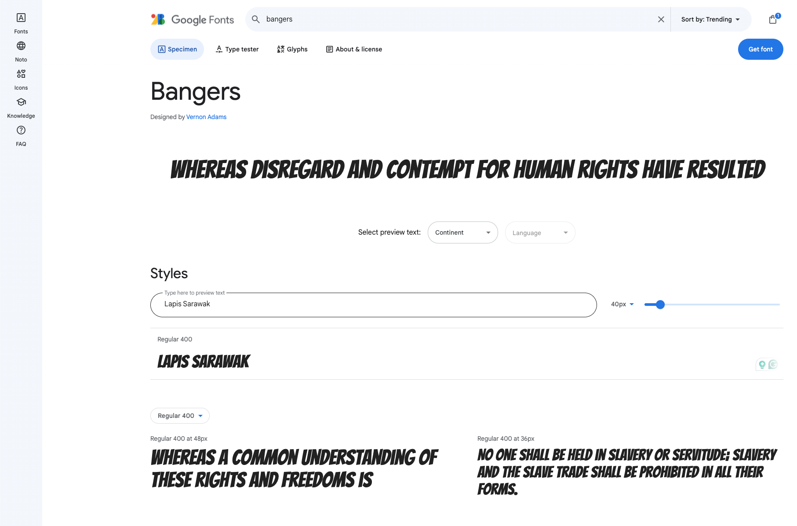

Google has a free online font library with over 1500 fonts to choose from. The site allows you to browse different fonts using your own sample text to help you find the right font. Google Fonts then gives you the **HTML** that you need to **import** the font into your website. 

Open [fonts.google.com](https://fonts.google.com/){:target="_blank"}. The link will open in a new tab. 

Type some sample text in the **Preview** box.

**Notice** that the examples show your sample text. You can see how your words will look in all of the fonts available. 

There are many different search filters to use. You can search by language, or different font properties.

Scroll down until you find a font you like. If you know the name of the font you want to use, type it in the main search box. 

**Notice** that you can now see an example of the Bangers font that has been applied to the sample text. 

Click on the card for the font you want to use.

Click on the 'Select' link (our example shows 'Select Regular 400').

**Notice** that a pane pops in from the side. The pane gives you the code that you need.

Click the copy icon to copy the HTML code.

Find the comment in your `index.html` document that says `<!-- Import fonts from Google -->`.

Paste the HTML code that you have just copied below the comment.

--- code ---
---
language: html
filename: index.html
line_numbers: true
line_number_start: 15
line_highlights: 16-18
---
  <!-- Import fonts from Google -->
  <link rel="preconnect" href="https://fonts.googleapis.com">
  <link rel="preconnect" href="https://fonts.gstatic.com" crossorigin>
  <link href="https://fonts.googleapis.com/css2?family=Bangers&display=swap" rel="stylesheet">

--- /code ---

You have imported the fonts that you need from the Google Font library. You now need to add in the correct CSS so that the web browser knows when to use this font. 

Go to your `default.css` file and find the `header-font` and `title-font` variables. 

**Replace** the current font `Verdana, sans-serif;` with the relevant options for your chosen font. In our example, we use `Bangers, cursive;`.

Go to your CSS colour palette file. This will be `default.css` or the file containing the colour palette you have chosen (for example `fiesta.css`).

Find the `header-font` , `title-font`, and `quote-font` variables. 

**Replace** the current font options.

--- code ---
---
language: css
filename: default.css
line_numbers: true
line_number_start: 15
line_highlights: 16-18
---
  --body-font: 1.1rem Verdana, sans-serif;
  --header-font: lighter 3rem 'Bangers', cursive;
  --title-font: lighter 2rem 'Bangers', cursive;
  --quote-font: lighter 1.5rem 'Bangers', cursive;

--- /code ---
