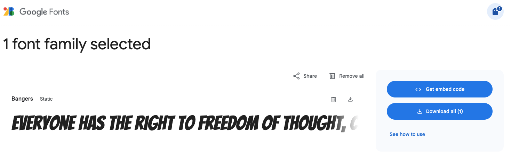
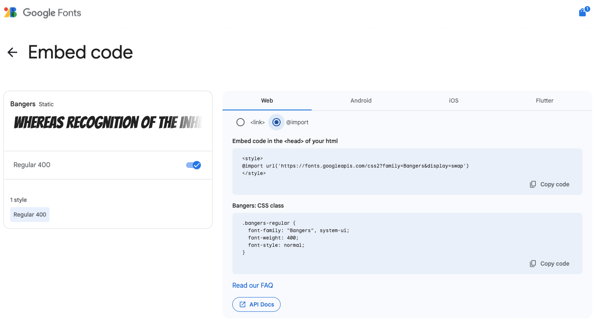

Google propose une bibliothèque de polices en ligne gratuite avec plus de 1 600 polices au choix. Le site te permet de parcourir différentes polices en utilisant ton propre exemple de texte pour t'aider à trouver la bonne police. Google Fonts te donne ensuite le code **HTML** et le **CSS** dont tu as besoin pour **lier** ou **importer** la police dans ton site web.

### Trouver une police

Ouvre [fonts.google.com](https://fonts.google.com/){:target="_blank"}.

Tape un exemple de texte dans la case **Preview**.

**Remarque** que les exemples montrent ton modèle de texte. Tu peux voir à quoi ressembleront tes mots dans toutes les polices disponibles.

Il existe de nombreux filtres de recherche différents. Tu peux effectuer une recherche par langue ou par différentes propriétés de police.

Fais défiler vers le bas jusqu'à ce que tu trouves une police qui te plaît. Si tu connais le nom de la police que tu veux utiliser, tape-le dans le champ de recherche principal.

**Remarque** que tu peux maintenant voir un exemple de la police Bangers qui a été appliquée au texte de l'échantillon.

### Choisis la taille de ta police

Cet exemple montre 40 px.

### Obtenir le code d'intégration

Clique sur le bouton « Get font » en haut à droite.

Tu verras les polices que tu as sélectionnées.

Clique sur le bouton « Get embed code ».

Tu peux utiliser la méthode `<link>` ou la méthode `<import>`.

### Méthode de lien

Copie et colle le code HTML à l'intérieur des balises `<head>` dans ton document HTML.

## --- code ---

language: html
filename:
line_numbers:
line_number_start: 1
line_highlights: 2-4
---------------------------------------------------------

  <!-- Import fonts from Google -->

  <link rel="preconnect" href="https://fonts.googleapis.com">
  <link rel="preconnect" href="https://fonts.gstatic.com" crossorigin>
  <link href="https://fonts.googleapis.com/css2?family=Bangers&display=swap" rel="stylesheet">

\--- /code ---

Tu dois ajouter le CSS correct pour que le navigateur web sache quand utiliser cette police.

Va dans ton fichier `default.css` et trouve les variables de police (il peut aussi s'agir du fichier contenant la palette de couleurs que tu as choisie, par exemple `fiesta.css`).

Ajoute (ou remplace) le code de la police que tu as choisie. Dans notre exemple, nous utilisons `Bangers, cursive;`.

## --- code ---

language: css
filename: default.css
line_numbers: true
line_number_start: 15
line_highlights: 16-18
-----------------------------------------------------------

\--body-font: 1.1rem Verdana, sans-serif;
\--header-font: lighter 3rem 'Bangers', cursive;
\--title-font: lighter 2rem 'Bangers', cursive;
\--quote-font: lighter 1.5rem 'Bangers', cursive;

\--- /code ---

### Méthode d'importation

Ouvre `style.css`.

Copie et colle le code d'importation en haut.

Assure-toi d'ajouter un point-virgule `;` à la fin de la ligne lorsque tu l'ajoutes à ton fichier CSS.

## --- code ---

language: css
filename: style.css
line_numbers:
line_number_start:
line_highlights:
-----------------------------------------------------

@import url('https://fonts.googleapis.com/css2?family=Bangers&display=swap');

\--- /code ---

Ouvre le fichier `default.css` et trouve les variables de police (il peut aussi s'agir du fichier contenant la palette de couleurs que tu as choisie, par exemple `fiesta.css`).

Ajoute (ou remplace) le code de la police que tu as choisie. Dans notre exemple, nous utilisons `Bangers, cursive;`.

## --- code ---

language: css
filename: default.css
line_numbers: true
line_number_start: 15
line_highlights: 16-18
-----------------------------------------------------------

\--body-font: 1.1rem Verdana, sans-serif;
\--header-font: lighter 3rem 'Bangers', cursive;
\--title-font: lighter 2rem 'Bangers', cursive;
\--quote-font: lighter 1.5rem 'Bangers', cursive;

\--- /code ---