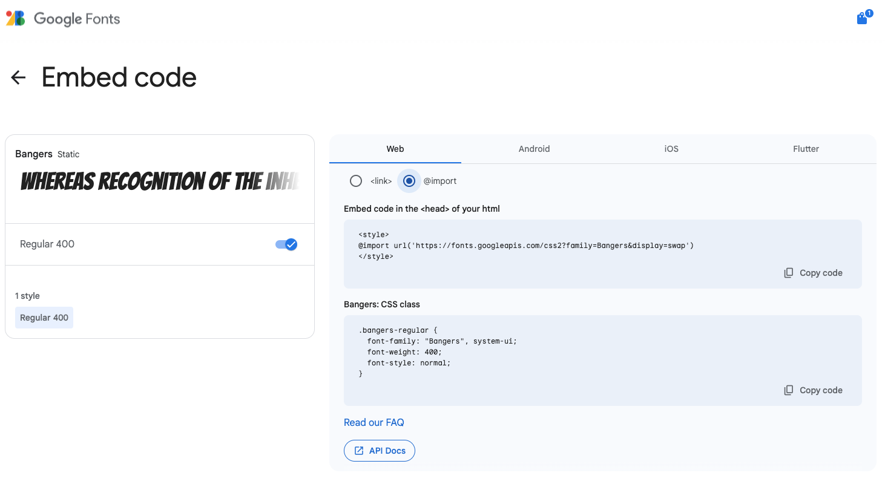

Google heeft een gratis online lettertype bibliotheek met meer dan 1600 lettertypen om uit te kiezen. De website stelt je in staat verschillende lettertypen te bekijken met behulp van je eigen voorbeeldtekst om je te helpen de juiste lettertype te vinden. Google Fonts geeft dan de **HTML** en **CSS** die je nodig hebt om het lettertype naar je website te **linken** of te **importeren**.

### Zoek een lettertype

Open [fonts.google.com](https://fonts.google.com/){:target="_blank"}.

Typ een voorbeeldtekst in het vak **Preview**.

**Let op** dat de voorbeelden je voorbeeldtekst tonen. Je kunt zien hoe je woorden er in alle beschikbare lettertypen uitzien.

Er zijn veel verschillende zoekfilters om te gebruiken. Je kunt zoeken op taal, of op verschillende lettertype-eigenschappen.

Scroll naar beneden tot je een lettertype vindt dat je leuk vindt. Als je de naam weet van het lettertype dat je wilt gebruiken, typ het dan in het hoofdzoekvak.

**Merk op** dat je nu een voorbeeld van het Bangers lettertype kunt zien dat is toegepast op de voorbeeldtekst.

### Kies je lettergrootte

Dit voorbeeld toont 40px.

### Haal de insluitcode op

Klik op de knop 'Get font' rechtsboven.

Je zult de geselecteerde lettertypen zien.

Klik op de knop 'Get embed code'.

Je kunt of de `<link>`-methode of de `<import>`-methode gebruiken.

### Link-methode

Kopieer en plak de HTML-code in de `<head>` tags in je HTML document.

--- code ---
---
language: html
filename: 
line_numbers: 
line_number_start: 1
line_highlights: 2-4
---

  <!--- Import fonts from Google --->
  <link rel="preconnect" href="https://fonts.googleapis.com">
  <link rel="preconnect" href="https://fonts.gstatic.com" crossorigin>
  <link href="https://fonts.googleapis.com/css2?family=Bangers&display=swap" rel="stylesheet">

--- /code ---

Je moet de juiste CSS toevoegen, zodat de webbrowser weet wanneer dit lettertype moet worden gebruikt.

Ga naar jouw `default.css`-bestand en zoek de lettertypevariabelen (het kan ook het bestand zijn dat het kleurenpalet bevat dat je hebt gekozen, bijvoorbeeld `fiesta.css`).

De code voor je gekozen lettertype toevoegen (of vervangen). In ons voorbeeld gebruiken we `Bangers, cursive;`.

--- code ---
---
language: css
filename: default.css
line_numbers: true
line_number_start: 15
line_highlights: 16-18
---
  --body-font: 1.1rem Verdana, sans-serif;
  --header-font: lighter 3rem 'Bangers', cursive;
  --title-font: lighter 2rem 'Bangers', cursive;
  --quote-font: lighter 1.5rem 'Bangers', cursive;

--- /code ---

### Import-methode

Open `style.css`.

Kopieer en plak de importcode bovenaan.

Zorg ervoor dat je een puntkomma `;` aan het einde van de regel toevoegt wanneer je het aan je CSS-bestand toevoegt.

--- code ---
---
language: css
filename: style.css
line_numbers: 
line_number_start: 
line_highlights:
---

@import url('https://fonts.googleapis.com/css2?family=Bangers&display=swap');

--- /code ---

Open `default.css` en zoek de lettertype variabelen (dit kan ook het bestand zijn met het kleurenpalet dat je hebt gekozen, bijvoorbeeld `fiesta.css`).

Voeg de code voor je gekozen lettertype toe (of vervang deze). In ons voorbeeld gebruiken we `Bangers, cursive;`.

--- code ---
---
language: css
filename: default.css
line_numbers: true
line_number_start: 15
line_highlights: 16-18
---
  --body-font: 1.1rem Verdana, sans-serif;
  --header-font: lighter 3rem 'Bangers', cursive;
  --title-font: lighter 2rem 'Bangers', cursive;
  --quote-font: lighter 1.5rem 'Bangers', cursive;

--- /code ---